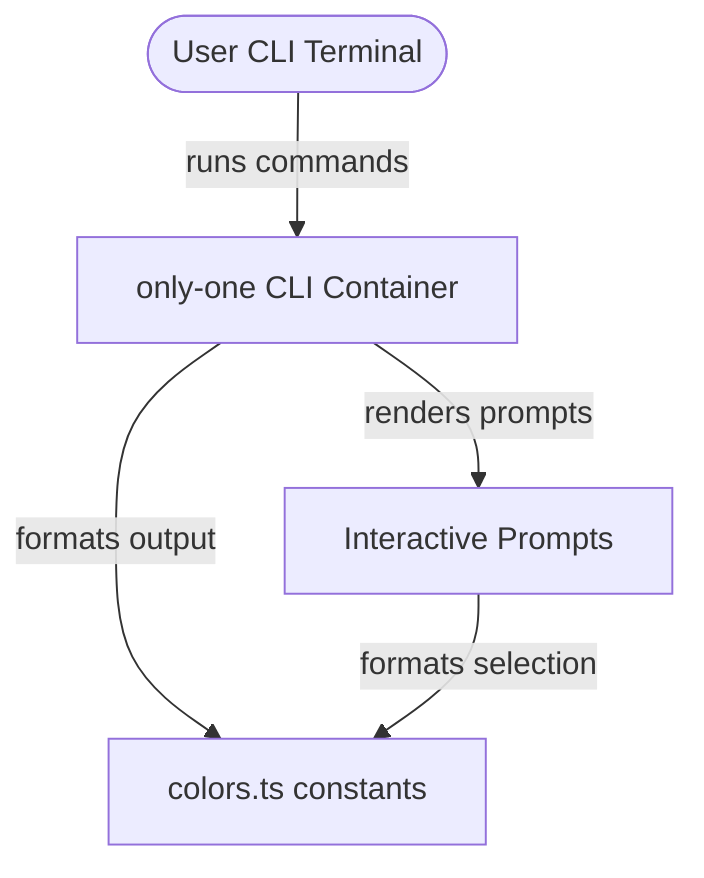

## Context

The current `only-one` CLI uses `picocolors` to style output text, titles, descriptions, and interactive prompts. The styling rules are centralized in `src/constants/colors.ts`. The goal is to ensure that no terminal text outputs use white or black colors, guaranteeing legibility across both dark and light terminal backgrounds.

## Goals / Non-Goals

**Goals:**
- Eliminate the use of `white`, `black`, `bgWhite`, and `bgBlack` foreground/background colors throughout the codebase.
- Ensure all text, titles, descriptions, and interactive elements use high-contrast, compliant colors (e.g., cyan, blue, yellow, green, magenta, red, or dim).

**Non-Goals:**
- Creating a dynamic terminal theme customizer.
- Replacing the styling library `picocolors` with another library.

## Architecture & Visual Flow (C4 Container Diagram)

- **User CLI Terminal**: The user's terminal environment which may have a light or dark background.
- **only-one CLI Container**: Entry point (`cli/index.ts`) configuring commander help layout and executing CLI commands.
- **colors.ts constants**: Defines styled theme/element colors mapping text to picocolors functions.
- **Interactive Prompts**: Custom prompts in `src/prompts/` (e.g., searchable multi-select) formatting prompts, options, selection chips, and error messages.

## Decisions

### Decision 1: Mapping CLI elements to compliant colors
We will update `src/constants/colors.ts` to ensure that no element maps to `white` or `black`. All colors must map to standard ANSI colors (cyan, blue, green, yellow, magenta, red, or dim).
- **Alternative considered**: Allowing standard default terminal text.
- **Rationale**: Default terminal text might look white on a dark terminal or black on a light terminal. Enforcing compliant colors like `cyan`, `blue`, `green`, `yellow`, `magenta`, `red` or `dim` ensures consistent rendering.

### Decision 2: Auditing files for raw color functions
We will perform a static code check and modify any direct imports or references to `picocolors` to ensure no `white`, `black`, `bgWhite`, or `bgBlack` is used directly in any commands or prompts.
- **Alternative considered**: Only checking the constants file.
- **Rationale**: Direct usage in prompts or other scripts could bypass the centralized constants. A full search ensures compliance.

## Risks / Trade-offs

- **[Risk]** Dim text style (`pc.dim`) might look very low contrast on certain light/dark terminal setups.
  - *Mitigation*: Ensure that dim text is only used for secondary decoration (like examples or hint messages) and crucial information uses high-contrast colors (e.g., green, yellow, cyan).

## Migration Plan

No schema changes or database migrations. This is a layout style update.

## Open Questions

None.
