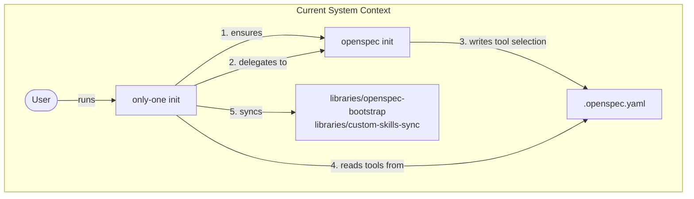
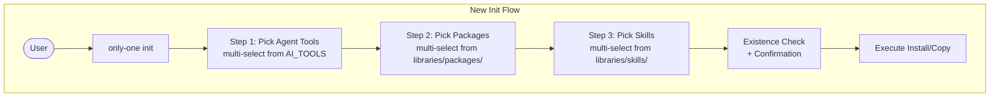

## Context

Current `init` command delegates to `openspec init` for tool selection and standard skill install, then syncs custom skills from `.agents/skills/`. The `libraries/` directory exists with structural subdirs (`openspec-bootstrap`, `custom-skills-sync`) but the init flow doesn't own the UX — it's a thin passthrough.

Problems:
- Hard dependency on `openspec` CLI being installed globally
- User can't see what packages/capabilities are available before deciding
- No existence-check or confirmation flow — `openspec init --force` silently overwrites
- Reversing the prior ADR (0001) which moved flow *out* of only-one; now bringing it back



## Goals / Non-Goals

**Goals:**
- Own the full init flow in `only-one` with 3 interactive steps: tools → packages → skills
- Read available items from `libraries/` manifests (packages YAML files, skills dirs, etc.)
- Check existence before each action; prompt user for confirmation if already exists
- Remove `libraries/openspec-bootstrap/` and `libraries/custom-skills-sync/` modules
- Move `.agents/skills/*` → `libraries/skills/*`
- Restructure `libraries/` to: `skills/`, `templates/`, `packages/`

**Non-Goals:**
- Not changing the `AI_TOOLS` list or tool mapping structure in `src/core/agent/tools.ts`
- Not modifying the per-tool skill directory resolution pattern
- Not building a full package manager — packages installed via `npm install -g`
- Not supporting remote skill download (skills are pre-copied)
- Not supporting templates in this change (infrastructure only)

## Decisions

### 1. Own the tool selection prompt instead of delegating to openspec

**Decision**: Use `searchableMultiSelect` prompt (already exists at `src/prompts/searchable-multi-select.ts`) to let user pick agent tools from `AI_TOOLS`.

**Rationale**: 
- Eliminates `openspec` CLI runtime dependency during init
- Gives `only-one` full control over UX, existence checks, and confirmation
- Reuses existing prompt infrastructure

**Alternative considered**: Continue delegating to `openspec init` and reading `.openspec.yaml`. Rejected because it forces users to go through two CLIs and can't do existence checks on tools.

### 2. Existence check + confirmation at every step

**Decision**: Before each action, check if target resources already exist:
- **Tools**: Check if tool's config dir (e.g., `.cursor/`) exists in project → prompt if user wants to overwrite skills
- **Packages**: Check if npm package is already installed globally (`npm list -g <pkg>`) → prompt to reinstall
- **Skills**: Check if skill dir already exists in target tool's skills dir → prompt to overwrite

All prompts use `@inquirer/confirm` for Y/N confirmation. Allow `--yes` flag to auto-confirm all.

**Rationale**: Prevents accidental overwrites. Gives user control over each action.

### 3. Package manifest format

**Decision**: Each package is a `.yaml` file in `libraries/packages/`:

```yaml
# libraries/packages/openspec.yaml
name: "@fission-ai/openspec"
description: "OpenSpec CLI for project setup and agent tool management"
scope: global  # 'global' (default) or 'local'
```

**Rationale**: Simple YAML per package, easy to add/customize. No need for a centralized index file — the init command simply reads `.yaml` files in `libraries/packages/`.

### 4. Restructure libraries directory

**Decision**:

```
libraries/
├── skills/                      # Pre-copied skill dirs (moved from .agents/skills/)
│   ├── architectural-decision-records/
│   ├── c4-diagrams/
│   ├── gherkin-authoring/
│   ├── grill-me/
│   └── openspec-git-discipline/
├── templates/                   # Template dirs (existing, unchanged)
├── packages/                    # Package manifests
│   └── openspec.yaml
├── openspec-bootstrap/          # [DELETE]
├── custom-skills-sync/          # [DELETE]
└── README.md
```

**Rationale**: Flat, discoverable structure. Each subdir has single responsibility. Skills are copied from `libraries/skills/` to each selected tool's `skillsDir`.

### 5. Update init command options



New flags:
- `--yes` — auto-confirm all overwrites (non-interactive for CI)
- `--step <name>` — skip to a specific step (tools, packages, skills)
- `--skip <name>` — skip a specific step
- `[path]` — project directory (default: cwd)

Removed flags: `--force`, `--no-install-skill`, `--tools`

## Risks / Trade-offs

- **Risk**: User has tools configured via openspec already → They'll need to re-pick with new flow → Mitigation: Message suggesting to run init again to refresh
- **Risk**: npm global install requires permissions → Mitigation: Check for errors and suggest `sudo` or `npm prefix` setup
- **Risk**: Breaking change for CI scripts using `--tools`, `--no-install-skill` → Mitigation: Deprecation warnings in prior release cycle (ADR 0001 already simplified the interface)
- **Trade-off**: Moving skills from `.agents/skills/` to `libraries/skills/` is a structural change but centralizes everything under `libraries/`
- **Trade-off**: No remote skill download support keeps things simple but means users must update `only-one` to get new skills

## Migration Plan

1. Create new `libraries/packages/openspec.yaml` manifest
2. Move `.agents/skills/*` → `libraries/skills/*`
3. Delete `libraries/openspec-bootstrap/` and `libraries/custom-skills-sync/`
4. Rewrite `src/core/init/init-command.ts` with 3-step flow
5. Update `src/core/init/types.ts` with new request/response types
6. Update `src/commands/init/command.ts` with new flags
7. Remove old references to deleted libraries from build chain
8. Test: `npx tsx src/index.ts init --yes` in a test project

## Open Questions

- Should the init flow also write `.openspec.yaml` with selected `agent_tools`? Currently openspec expects this config. Without it, openspec commands won't know which tools are active. Leaning: yes, write `.openspec.yaml` after steps 1-3 so openspec and only-one stay consistent.
