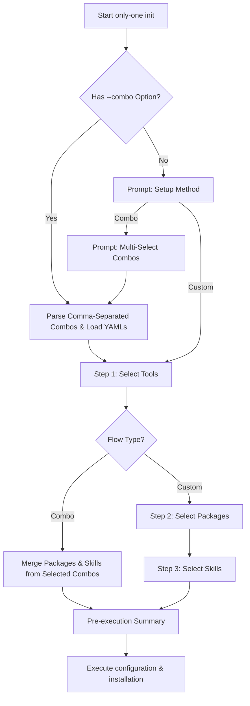

## Context

Currently, the `only-one init` command runs three sequential interactive multi-select steps: Tool selection/configuration, Package selection, and Skill selection. This design updates the wizard flow to support "Combos" — predefined sets of packages and skills stored as YAML manifests under `libraries/combos/`. This simplifies initialization for standard setups while preserving the original custom flow. Tool selection remains a mandatory first step regardless of selection. Multiple combos can be selected and their packages/skills merged dynamically.



## Goals / Non-Goals

**Goals:**
- Provide a `--combo <names>` CLI option to initialize using a comma-separated list of combos directly.
- Add an interactive prompt choice at the start of `init` to select either "Combo" (default) or "Custom" setup.
- If "Combo" is chosen, list available combo definitions found under `libraries/combos/*.yaml` using a multi-select prompt.
- Ensure selected combos automatically merge packages and skills (deduplicating them), bypassing Steps 2 and 3, but still prompting for Tool selection (Step 1).

**Non-Goals:**
- Bypassing agent tool selection (Step 1) which remains mandatory.

## Decisions

### 1. Combo YAML File Structure
We will store combo YAMLs in `libraries/combos/`. A combo manifest will contain:
- `name`: Human-readable name
- `description`: A brief description
- `packages`: List of package names (string[])
- `skills`: List of skill names (string[])

Example: `libraries/combos/default.yaml`
```yaml
name: "Default Agent Setup"
description: "Recommended agent workspace setup"
packages:
  - "@fission-ai/openspec"
skills:
  - "grill-me"
  - "openspec-git-discipline"
```

### 2. Integration into Init Flow
We will introduce `executeInitCommand` options changes:
- `combo?: string` CLI parameter (comma-separated list of combo names).
- If `combo` is provided, we split and load the combo YAMLs, prompt for tools (Step 1), and then proceed with the merged packages and skills.
- If not provided, we show a multi-select prompt of combos loaded from `libraries/combos/*.yaml`. We also provide a "Custom (original manual flow)" option or choice.

## Risks / Trade-offs

- **[Risk]**: Merging multiple combos causes conflict.
  - *Mitigation*: We will use a standard set union/deduplication for package names and skill names. If the same package is declared in two combos, it is installed once.

## Migration Plan

Not applicable as this is a purely additive backward-compatible CLI option.

## Open Questions

None.
