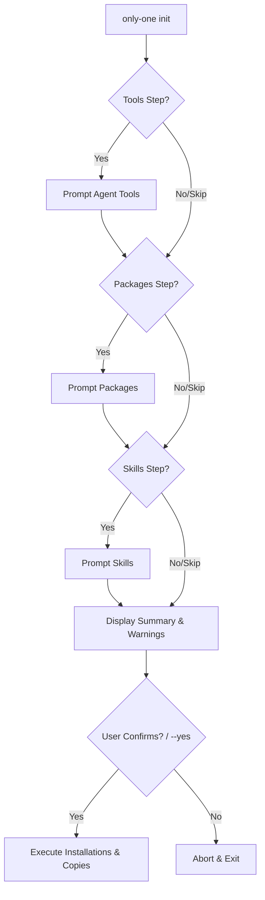

## Context

The `init` command of `only-one` allows users to configure agent tools, packages, and custom skills for their project. Currently, the command runs each step (Tools, Packages, Skills) sequentially and immediately executes actions (existence checks, installs, copy operations) after each step prompt. This makes the UI feel disjointed, offers little visibility into what will happen, and lacks a final confirmation before modifying files or installing packages.

We need to optimize the interactive flow to:
1. Gather all configuration inputs first.
2. Enrich prompts with status indicators (`configured` / `detected`).
3. Display a detailed and formatted summary of planned modifications before execution.
4. Warn the user if they are overwriting existing directories or reinstalling packages.
5. Provide a single final confirmation point.

## Goals / Non-Goals

**Goals:**
- Separate input gathering (prompts) from execution (file system and npm side effects).
- Add `(configured)` and `(detected)` badges to choices in interactive prompts to improve visibility.
- Build a structured pre-execution summary showing exactly what will be created, reinstalled, or overwritten.
- Let the user cancel the entire initialization safely before any modifications occur.
- Retain support for existing command-line options (`--yes`, `--step`, `--skip`).

**Non-Goals:**
- Changing the underlying tools, packages, or skills definitions.
- Modifying other CLI commands.

## Decisions

### 1. Separate Prompting from Execution (Wizard Flow)
We will refactor `executeInitCommand` to run all selected steps' prompts first to collect selection state.
Only after all selections are collected and confirmed will the execution of those selections take place.

### 2. Enrich Prompt Choices with Status Badges
- **Tools**: Check if `skillsDir` exists (mark `configured: true`). Check if `detectionPaths` exist (mark `detected: true`).
- **Packages**: Call `isPackageInstalled` concurrently before rendering the packages prompt (mark `configured: true`).
- **Skills**: Check if the skill already exists in any selected tool's skills directory (mark `configured: true`).

### 3. Final Confirmation Screen and Detailed Formatting
We will construct a clear text block detailing:
- **Tools to Configure**: Showing new versus reinstall/refresh.
- **Packages to Install**: Showing new versus reinstall.
- **Skills to Copy**: Listing the source, destination, and overwrite warnings.

If any resource already exists, we print a warning label (e.g., `[Reinstall]` or `[Overwrite]`).
We will prompt the user with a single `confirm` prompt: `"Proceed with the above changes? [y/N]"`.

## Risks / Trade-offs

- **[Risk]**: Checking global/local package status asynchronously via `npm list` for all package manifests might be slow.
- **[Mitigation]**: Only check status of packages defined in the manifest files. Since there are typically very few manifests, checking them in parallel using `Promise.all` keeps the latency minimal.

## Migration Plan

No database or schema migration is needed. The updated UI will be delivered transparently in the next CLI version.

## Open Questions

None.
