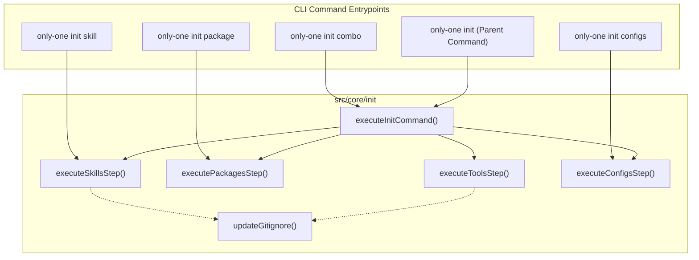

## Context

The `only-one` CLI uses `commander` to orchestrate project initialization. The initialization wizard is monolithic and interactive by default. To support modular usage (e.g., in CI or automation scripts), we will decompose the initialization flow into subcommands (`init combo`, `init skill`, `init package`, `init configs`) while retaining the main `init` command's interactive behavior by having it delegate to these subcommand logic paths. We will also implement automatic updates to `.gitignore` to ignore local agent/tool directories (e.g., `.cursor/`, `.claude/`, etc.) by default.

## Goals / Non-Goals

**Goals:**
- Expose subcommands: `init combo`, `init skill`, `init package`, `init configs`.
- Subcommands support direct arguments (e.g. `only-one init package typescript,prettier`) as well as interactive mode when arguments are omitted.
- Share execution logic between parent `init` command and subcommands to ensure DRY codebase.
- Automatically add paths of initialized tools/skills to the project's `.gitignore` by default.
- Add `--no-ignore` option to opt out of the `.gitignore` update.

**Non-Goals:**
- Support custom user-defined gitignore rules in the `--ignore` command option.
- Support a dedicated subcommand for configuring tools alone (`init tools`).
- Change the core behavior of skill syncing or package installation.

## Decisions

### 1. Commander Subcommand Structure
We will register subcommands directly under the `init` command using Commander nested commands.
```typescript
const initCmd = new Command('init');
initCmd.command('package').action(...);
// etc.
```
- **Rationale**: Keeps CLI configuration modular.
- **Alternatives Considered**: Keeping a separate `init tools` subcommand. Rejected because tool configuration is tightly coupled with packages/skills setups and does not require its own standalone subcommand in this scope.

### 2. Architecture: Refactoring Core Logic
We will refactor the step functions (`executeToolsStep`, `executePackagesStep`, `executeSkillsStep`, `executeConfigsStep`) in `src/core/init/init-command.ts` to be exported and accept parameters directly (in addition to prompts) so subcommands can call them directly.



- **Rationale**: Promotes maximum reuse. The parent `init` orchestrator remains the entry point for combo/wizard-based initialization, while subcommands bypass other steps and invoke their respective step logic directly.

### 3. Gitignore Management
Create a helper function `updateGitignore(projectDir: string, pathsToIgnore: string[])` in `src/core/init/gitignore.ts` to append directories to `.gitignore` if they do not already exist.

## Risks / Trade-offs

- **[Risk]** Writing to `.gitignore` might modify user's custom formatting/comments in their `.gitignore`.
  - **Mitigation**: We will only append entries to the end of the file in a distinct section (e.g., `# Only One CLI Generated`) and check if the entry already exists before appending.

- **[Risk]** Direct subcommand execution bypasses some dependency resolution (e.g., installing a skill without selecting the tool first).
  - **Mitigation**: Subcommands will perform runtime validation and warn/exit if prerequisites are missing.

## Migration Plan

No database or major data migrations. This is a CLI UX upgrade. We will update the package version in `package.json` to reflect the new capabilities.

## Open Questions

None.
