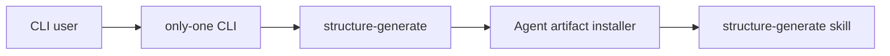

## Context

`only-one` currently registers both `structure-generate` and `structure-apply`. The latter also owns a generated agent skill and command template. Structure skill checks and installation couple both workflows: installing or validating generation also installs or requires apply artifacts. Removing only CLI registration would leave generated agent instructions that call a nonexistent command.

This lightweight C4-inspired component view shows the intended boundary after removal: CLI and artifact installer retain only supported generation workflow. Archived OpenSpec records remain historical and are outside runtime/package behavior.

## Goals / Non-Goals

**Goals:**

- Remove `structure-apply` from public CLI surface.
- Remove apply-specific source, types, templates, and generated agent artifacts.
- Decouple generation skill checks and installation from apply artifacts.
- Audit legacy `hybrid-index` naming across source, build output, npm package contents, and installed CLI output.
- Remove all active user-facing legacy branding and classify retained internal/historical references.
- Keep build, tests, help output, and published package consistent.

**Non-Goals:**

- Remove or rename `structure-generate`.
- Change persisted config paths or formats.
- Rewrite archived OpenSpec history.
- Require repository-wide internal identifier renaming when an identifier is proven non-user-facing and intentionally retained.

## Decisions

### Remove command and apply artifacts together

Delete command implementation, exports, registration, template, and installer branches as one breaking change. This prevents stale skills from instructing agents to invoke a removed command.

Alternative considered: unregister CLI command but retain apply skill/template. Rejected because generated instructions would become invalid.

### Simplify shared skill installation to generation only

`ensureStructureAgentSkills` and `installAgentArtifacts` will validate/install only requested structure-generation artifacts. Apply-specific optional parameters and branches will be removed when no remaining caller needs them.

Alternative considered: preserve generic branching for future workflows. Rejected because current abstraction exists specifically for removed apply artifacts and adds dead complexity.

### Audit legacy branding by exposure boundary

Search case-insensitively for `hybrid-index`, `hybridIndex`, `HybridIndex`, and equivalent separator variants in active source, scripts, tests, generated `dist`, packed npm contents, and installed CLI help. Every match will be classified as user-facing, packaged internal, source-only internal, or historical archive. User-facing matches must be removed. Retained matches require explicit rationale in verification results.

Alternative considered: scan only command help. Rejected because stale branding can enter published packages through scripts, generated output, templates, or runtime error text.

### Preserve historical OpenSpec records

Active source, tests, package output, and README must contain no supported `structure-apply` path or user-facing `hybrid-index` branding. Archived changes may retain historical references.

Alternative considered: rewrite archives. Rejected because archives document prior decisions and are not runtime behavior.

### No new ADR

Accepted ADR 0001 governs init delegation and custom skills sync. This removal does not reverse that decision; it narrows project-owned structure artifacts. No durable architecture decision requires a new ADR.

## Risks / Trade-offs

- [Existing users rely on `structure-apply`] -> Mark removal as breaking and ensure help no longer advertises it.
- [Previously installed apply skills remain in consumer projects] -> Stop generating new copies; document that update does not guarantee deletion of external stale files unless existing update behavior already supports cleanup.
- [Shared installer tests encode two-artifact behavior] -> Update expectations and run full test suite.
- [Dead imports or exports survive deletion] -> Search source and package for `structure-apply`, `createStructureApplyCommand`, and `STRUCTURE_APPLY`.
- [Legacy branding survives in generated or packaged files] -> Scan after build, after pack, and after local install; fail verification for any unexplained active match.

## Migration Plan

1. Audit and classify current `hybrid-index` matches before edits.
2. Remove CLI registration/export and command files.
3. Remove apply template and installer/check dependencies.
4. Remove active user-facing legacy branding found by audit.
5. Update README and tests.
6. Build and run full tests.
7. Pack and publish locally, then verify package contents and CLI help.
8. Re-run legacy branding scan and document any intentionally retained internal or historical match.

Rollback restores deleted files and registrations from the proposal implementation commit. No data migration is required.

## Open Questions

None. User confirmed removal includes command, skill/template, installation logic, and documentation.
