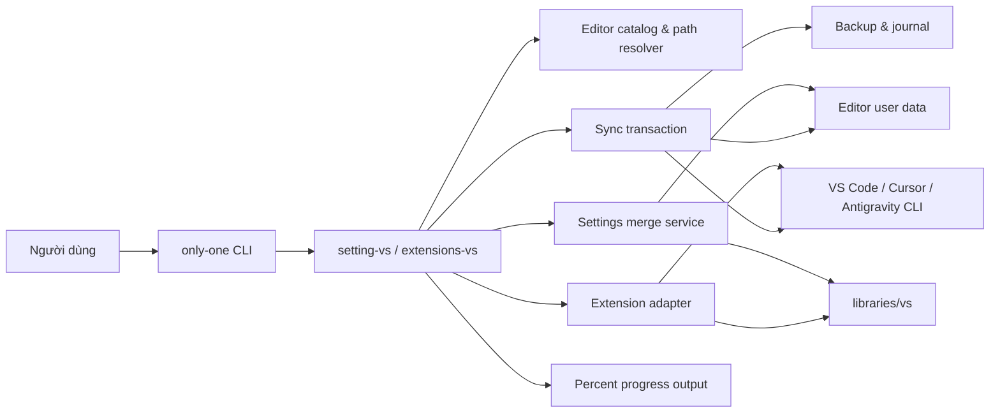

## Context

`only-one` hiện có kiến trúc command theo module và đóng gói `libraries`, nhưng chưa có abstraction cho editor desktop, merge JSON, báo tiến độ hoặc transaction filesystem. Thay đổi chạy trên macOS và Windows, tác động VS Code, Cursor và Antigravity, đồng thời phải giữ cấu hình/extension đang có. ADR 0001 vẫn có hiệu lực nhưng chỉ ràng buộc `init`; hai command mới độc lập và không tái tạo luồng cài tool/skill của `openspec init`.

Đây là sơ đồ component C4-inspired nhẹ. `only-one CLI` là runtime container; các node bên trong là component. Editor CLI và user data là ranh giới bên ngoài do từng editor quản lý.

## Goals / Non-Goals

**Goals:**

- Cho phép chọn một hoặc nhiều editor đã hỗ trợ trong mỗi lần chạy.
- Merge `settings.json` với dữ liệu từ `libraries` thắng khi trùng key và giữ key riêng của máy đích.
- Cài extension còn thiếu từ danh sách ID qua CLI chính thức của editor.
- Hiển thị tiến độ 0-100% có tính đơn điệu và kết thúc rõ ràng.
- Khôi phục trạng thái trước phiên chạy nếu lỗi, nhận signal, hoặc phát hiện journal dở dang ở lần chạy sau.
- Tách logic platform/editor khỏi command để kiểm thử không phụ thuộc máy thật.

**Non-Goals:**

- Đồng bộ keybindings, snippets, profiles, binary hoặc cache extension.
- Gỡ extension hiện có nhưng không nằm trong `libraries`.
- Hỗ trợ Linux trong thay đổi này.
- Đồng bộ cloud hoặc theo dõi thay đổi hai chiều.
- Thay thế chức năng Settings Sync tích hợp của editor.

## Decisions

### 1. Catalog editor khai báo tập trung

Tạo descriptor typed cho từng editor gồm ID, tên hiển thị, executable candidates và hàm resolve đường dẫn `settings.json` theo `darwin`/`win32`. Command dùng chung catalog để discovery và multi-select.

**Lý do:** tránh rải hardcode path/executable trong hai command. **Phương án loại:** logic `switch` riêng trong từng command vì dễ lệch hành vi.

### 2. Nguồn cấu hình đặt tại `libraries/vs`

Dùng một `settings.json` nguồn và một file JSON chứa extension ID; manifest có thể khai báo override theo editor nếu cần nhưng dữ liệu chung là mặc định. JSON được validate trước khi mở transaction.

**Lý do:** file dễ review, publish cùng package và không chứa binary phụ thuộc nền tảng. **Phương án loại:** copy toàn bộ thư mục extension vì dễ hỏng ABI/cache và tốn dung lượng.

### 3. Deep merge object, thay thế giá trị không phải object

Merge đệ quy plain object. Source trong `libraries` thắng scalar, array và xung đột type. Key chỉ có ở target được giữ. Output ổn định, JSON hợp lệ và giữ indentation chuẩn; không cam kết giữ comment vì `settings.json` JSONC có thể chứa comment, nên parser phải hỗ trợ JSONC hoặc báo lỗi trước khi ghi.

**Lý do:** phù hợp mong muốn source thắng nhưng không đè toàn file. **Phương án loại:** shallow merge vì mất nested key; merge array vì semantics không rõ và có thể tạo cấu hình sai.

### 4. Extension adapter qua process runner

Mỗi editor adapter list extension hiện có và gọi executable chính thức với extension ID còn thiếu. Danh sách được normalize case-insensitive và deduplicate. Không gỡ extension ngoài manifest.

**Lý do:** editor chịu trách nhiệm layout và compatibility. **Phương án loại:** copy extension folders vì không bảo đảm tương thích.

### 5. Transaction journal và rollback bù trừ

Mỗi command tạo journal bền vững trước thay đổi đầu tiên, lưu snapshot file settings và danh sách extension được cài bởi phiên. Ghi file qua temp file cùng filesystem rồi atomic rename. Khi lỗi hoặc signal có thể xử lý, rollback khôi phục file và uninstall chính các extension phiên vừa cài. Khi khởi động, command kiểm tra journal chưa commit và rollback trước khi bắt đầu phiên mới. Journal chỉ được xóa sau commit hoặc rollback thành công.

**Lý do:** đạt all-or-nothing trong giới hạn CLI ngoài tiến trình. **Phương án loại:** chỉ resume vì người dùng yêu cầu trở về trạng thái trước chạy; chỉ backup file không đủ cho extension.

### 6. Progress theo work units xác định trước

Planner tạo work units gồm validate, backup, từng editor settings, từng extension và finalize. Reporter phát phần trăm `floor(completed / total * 100)`, không giảm, bắt đầu 0 và chỉ phát 100 sau commit. Rollback có phase/status riêng để tránh báo thành công giả.

**Lý do:** phần trăm phản ánh lượng việc thay vì timer. **Phương án loại:** spinner không đáp ứng yêu cầu; trọng số thời gian động làm phần trăm nhảy khó đoán.

## Risks / Trade-offs

- [Editor path hoặc executable thay đổi theo phiên bản] -> Catalog tập trung, discovery nhiều candidate và lỗi hướng dẫn rõ editor nào bị thiếu.
- [JSONC có comment không thể round-trip nguyên văn] -> Dùng parser JSONC; backup bảo toàn bản gốc để rollback, tài liệu hóa rằng lần merge chuẩn hóa formatting/comment.
- [SIGKILL hoặc mất điện không cho rollback tức thì] -> Journal ghi trước mutation; lần chạy sau bắt buộc recovery trước thao tác mới.
- [Uninstall extension rollback có thể thất bại] -> Retry có giới hạn, giữ journal và báo command recovery; không xóa bằng filesystem trực tiếp.
- [Nhiều editor làm transaction kéo dài] -> Work units và progress rõ; tuần tự hóa mutation để rollback xác định.
- [Extension được cài đồng thời bởi tiến trình khác] -> Snapshot trước chạy và chỉ ghi compensation cho install do phiên xác nhận thành công.

## Migration Plan

1. Thêm dữ liệu `libraries/vs` và validator mà chưa thay command hiện có.
2. Thêm editor catalog, process runner, merge/progress/transaction services cùng unit tests đa nền tảng.
3. Đăng ký `setting-vs` và `extensions-vs`, thêm integration tests với filesystem/process giả lập.
4. Build package và kiểm tra `libraries/vs` được publish.
5. Nếu cần rollback release, bỏ đăng ký command; journal còn lại vẫn phải được recovery bằng phiên có implementation trước khi downgrade.

## Open Questions

Không còn câu hỏi chặn implementation. Không cần supersede ADR 0001 vì command mới không thay đổi trách nhiệm của `only-one init`.
