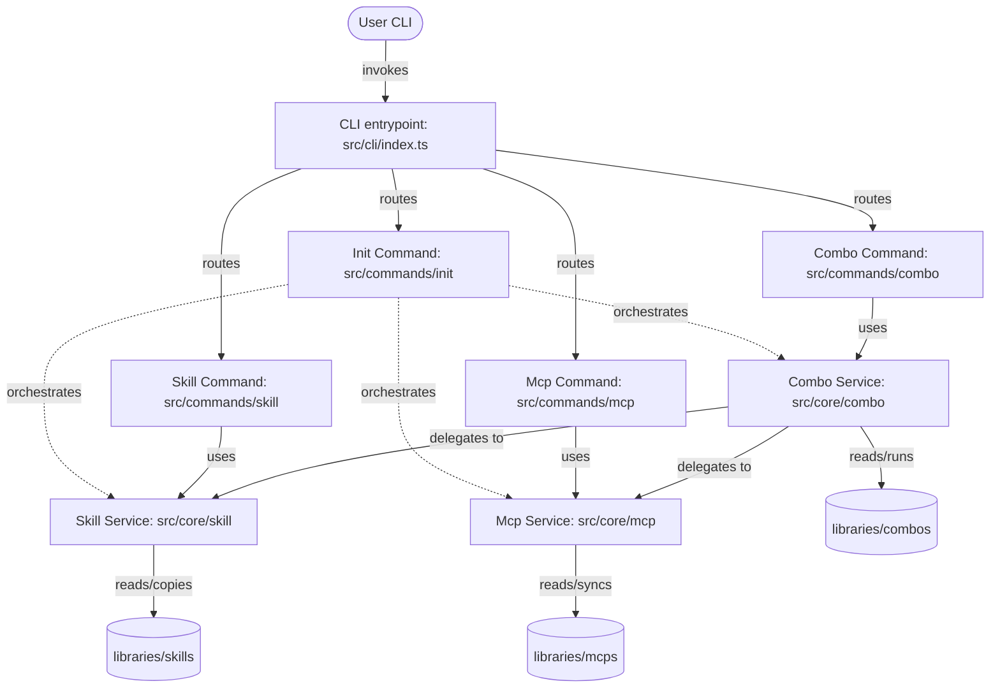

## Context

The current `only-one-cli` codebase contains a large monolithic `init-command.ts` under `src/core/init/` which handles all steps of command execution. The goal is to break this down into three modular commands (`skill`, `mcp`, `combo`) while retaining `init` as an orchestrator that invokes them.

### C4 Container Diagram (Architecture)

---

## Goals / Non-Goals

**Goals:**
- Extract independent core services for `skill`, `mcp`, and `combo`.
- Add target IDE selection to all commands.
- Implement duplicate checks prior to all installation operations.
- Require interactive verify/confirmation checkboxes (pre-selected by default) for overwriting/reinstalling existing components.
- Output detailed execution results showing Success, Overwritten/Merged, Skipped, and Failed components.

**Non-Goals:**
- Changing how VS Code extensions or settings are synced (those remain under `extensions-vs` and `setting-vs`).
- Refactoring core IDE adapters or VsSyncTransaction.

---

## Decisions

### Decision 1: Separation of Command Code
- **Option 1**: Separate the core services into `src/core/skill/`, `src/core/mcp/`, and `src/core/combo/` while keeping their CLI entrypoints under `src/commands/...`.
- **Option 2**: Put all logic directly inside the command files.
- **Rationally Chosen**: **Option 1**. Keeping core logic separate from CLI parser commands allows for cleaner unit testing, modular reuse, and lets the main `init` wizard easily orchestrate them without importing CLI command definitions.

### Decision 2: Implementation of the Verification Checklist (Verify Step)
- **Problem**: When a package, skill, config, or MCP already exists, how do we confirm which ones the user wants to overwrite?
- **Rationally Chosen**: Use the `@inquirer/prompts` checkbox (or a custom inquirer multi-select checkbox prompt) to display the existing items. Since the prompt should have these checked by default, we will map existing items to Choices with `checked: true`. Users can uncheck to skip. If the CLI runs in non-interactive/auto-confirm mode (`--yes`), skip the prompt and overwrite all.

---

## Risks / Trade-offs

- **[Risk] Multiple IDE configurations for MCP** -> Antigravity and Cursor have different config formats or locations.
  - *Mitigation*: Leverage the existing global MCP adapters (`cursorMcpAdapter`, `antigravityMcpAdapter`) and transaction system (`VsSyncTransaction`) to make updates safe and transactional.
- **[Risk] High number of checkboxes on large combo setups** -> Too many existing packages/configs/skills might clutter the prompt.
  - *Mitigation*: Group them logically (e.g. by component type: Packages, Skills, Configs, MCPs) and display clear labels indicating target paths.

---

## Migration Plan

Not applicable. This is a local developer CLI tool. Users will automatically run the updated version upon installing the new package build locally.

---

## Open Questions

None at this moment. The requirements specified by the user are fully captured in the proposed flow.
