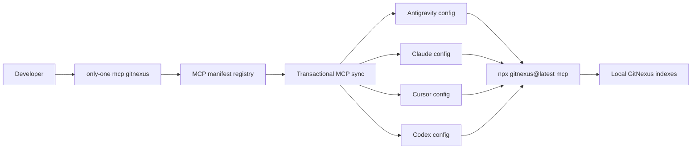

## Context

`only-one` đã có MCP registry và luồng đồng bộ transactional cho Antigravity, Claude, Cursor và Codex. GitNexus cung cấp code knowledge graph qua MCP nhưng chưa có trong registry. Tích hợp chỉ cần thêm manifest và kiểm chứng các codec/adapter hiện có bảo toàn `args` cùng `env`; không cần tạo runtime MCP hay cơ chế setup riêng.

ADR 0001 đang có hiệu lực yêu cầu tránh lặp lại chức năng setup agent đã được công cụ chuyên trách cung cấp. Thiết kế này phù hợp: `only-one` chỉ đăng ký và đồng bộ cấu hình MCP; GitNexus chịu trách nhiệm index repository và phục vụ MCP.

- Ranh giới `only-one`: lựa chọn manifest, chuyển đổi định dạng, merge và rollback cấu hình.
- Ranh giới GitNexus: tạo/đọc index, expose MCP tools và thực thi read-only policy.
- Agent config là dữ liệu bền vững; GitNexus process được agent khởi chạy qua stdio.
- Giả định: người dùng đã chạy `gitnexus analyze` cho repository cần truy vấn.

## Goals / Non-Goals

**Goals:**
- Cho phép chọn `gitnexus` bằng lệnh MCP hiện có.
- Đồng bộ cùng một cấu hình read-only tới bốn target được hỗ trợ.
- Giữ nguyên transaction, prompt reconfigure và codec JSON/TOML hiện có.
- Cung cấp các công cụ đọc cần cho khám phá, impact analysis và lập kế hoạch code.

**Non-Goals:**
- Không thêm lệnh `gitnexus analyze`, `setup`, skills hoặc hooks.
- Không quản lý vòng đời index hay cài GitNexus global.
- Không bật `rename`, raw `cypher`, group tools hoặc thao tác ghi.
- Không thêm allowed-repository/default-repository policy vì giá trị phụ thuộc máy người dùng.

## Decisions

### Dùng manifest registry hiện có

Thêm entry `gitnexus` vào registry với `command: npx`, `args: [-y, gitnexus@latest, mcp]`, và `env.GITNEXUS_MCP_READ_ONLY: "1"`. Cách này tự động dùng selection, validation, merge, transaction và target codecs hiện có.

Phương án loại: gọi `gitnexus setup`. Lệnh upstream ghi trực tiếp nhiều config, skills và hooks, trùng trách nhiệm với `only-one`, khó nằm trong transaction đa-target.

### Ghim channel `latest`, không thêm package dependency

Manifest chạy `gitnexus@latest` theo hướng dẫn MCP chính thức. `only-one` không bundle GitNexus và không tăng kích thước package.

Phương án loại: ghim version. Tái lập tốt hơn nhưng nhanh lỗi thời với schema/tool surface của upstream và cần quy trình nâng version riêng.

### Read-only mặc định

`GITNEXUS_MCP_READ_ONLY=1` vẫn cung cấp bề mặt proven single-repository cho query/context/impact/trace và các công cụ phân tích kiến trúc, đồng thời loại công cụ sửa đổi, raw Cypher và group routing. Đây là default phù hợp workflow lập kế hoạch.

Phương án loại: full tools. Linh hoạt hơn nhưng cấp quyền không cần thiết cho use case đã chốt.

### Không dùng credential placeholder

GitNexus MCP local không cần secret. Biến `GITNEXUS_MCP_READ_ONLY` là policy value cố định, không được báo như credential cần hoàn thiện.

## Risks / Trade-offs

- `[gitnexus@latest có breaking change]` -> Kiểm thử contract manifest cục bộ; tài liệu nêu dependency động và cho phép người dùng sửa config sau sync nếu cần pin.
- `[npx cold start vượt timeout agent]` -> Tài liệu khuyến nghị cài GitNexus global khi gặp chậm, nhưng giữ manifest portable theo upstream.
- `[Repository chưa được index]` -> README yêu cầu chạy `npx gitnexus@latest analyze` trước khi dùng tools.
- `[Policy env bị hiểu là credential]` -> Kiểm thử summary không yêu cầu người dùng điền `GITNEXUS_MCP_READ_ONLY`.
- `[Read-only thiếu raw/group capabilities]` -> Nêu rõ phạm vi; người dùng có thể tự sửa config nếu chấp nhận quyền rộng hơn.

## Migration Plan

1. Thêm manifest và unit tests.
2. Chạy test registry, codecs, sync và CLI MCP.
3. Cập nhật README với lệnh sync và bước index prerequisite.
4. Phát hành như thay đổi add-only; cấu hình hiện có không đổi nếu người dùng không chọn GitNexus.
5. Rollback bằng cách xóa manifest/docs/tests; config đã sync trên máy người dùng được giữ theo semantics add-only và có thể xóa thủ công.

## Open Questions

Không còn câu hỏi mở. Thiết kế không yêu cầu thay thế ADR hiện hành.
