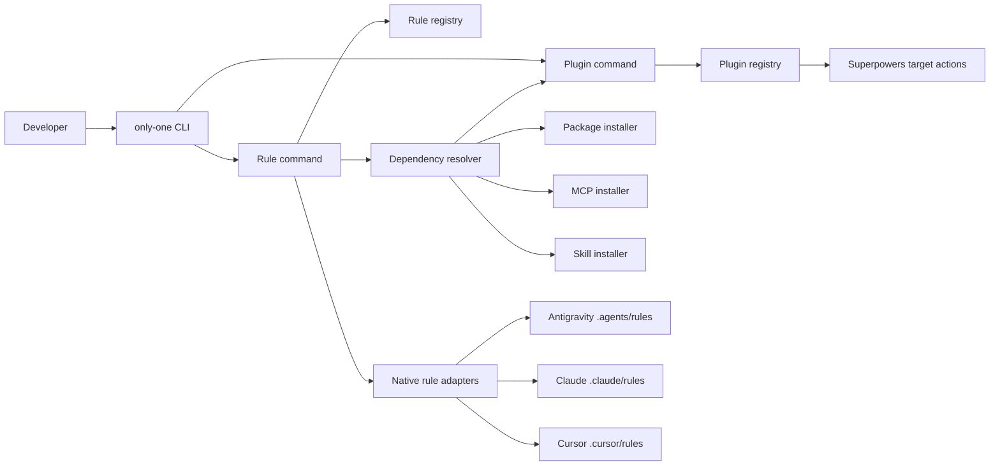

## Context

Current implementation has typed registries for packages, MCPs, skills, workflows, configs, combos, and VS assets. Superpowers was recently added as a `target-plugin` variant inside package metadata, forcing package types and package installation to model non-package behavior. No plugin registry, rule registry, native rule adapters, or cross-domain rule dependency resolver exists.

Agent rule mechanisms differ by host. Antigravity supports `.agents/rules/*.md`; Claude supports recursively discovered `.claude/rules/*.md`; Cursor supports project rules under `.cursor/rules/`; Codex uses hierarchical `AGENTS.md` files rather than a dedicated native rule directory. Plugin targets remain Antigravity, Claude, Cursor, and Codex, while rule targets must be capability-filtered to Antigravity, Claude, and Cursor.

Rule `context-minimization` applies before planning or modification and requires OpenSpec package, Superpowers plugin, and GitNexus MCP. Rules may later require packages, plugins, MCPs, and skills. Dependencies must be queued automatically, but manual plugin actions cannot be falsely reported installed.

ADR 0001 remains accepted and not superseded. Top-level component commands follow current `skill`, `mcp`, and `combo` direction; init may orchestrate their core flows without reclaiming OpenSpec's standard initialization responsibility.

### Lightweight C4 view



- Plugin command owns host plugin actions; npm package command returns to npm-only behavior.
- Rule command resolves all declared dependencies before copying rule assets.
- Rule adapters own native path and rendering differences.
- Codex remains a plugin target but is absent from rule target selection.
- Manual plugin dependencies allow rule installation but leave readiness as `action-required`.

## Goals / Non-Goals

**Goals:**

- Add first-class typed plugin and rule asset domains under `assets/`.
- Move Superpowers from package registry to plugin registry with unchanged target behavior.
- Add `only-one plugin` and `only-one rule` commands using shared target selection.
- Support rule dependencies on packages, plugins, MCPs, and skills with automatic queueing.
- Install rules through verified native directories for Antigravity, Claude, and Cursor.
- Add `context-minimization` rule with OpenSpec, Superpowers, and GitNexus dependencies.
- Report per-target installation and readiness accurately.

**Non-Goals:**

- Keeping `superpowers` as a package alias.
- Giving plugins their own dependencies.
- Managing plugin updates or verifying manual plugin installation.
- Merging rules into Codex `AGENTS.md`.
- Supporting generic arbitrary dependency cycles.
- Bundling or modifying Superpowers content.
- Replacing existing package, MCP, or skill installers.

## Decisions

### 1. Separate package, plugin, and rule manifests

`PackageManifest` returns to npm identity, scope, and description. New `PluginManifest` contains stable ID, description, supported targets, and target actions. Target actions reuse command/manual semantics already proven by Superpowers implementation.

`RuleManifest` contains stable ID, description, source Markdown path, supported targets, optional output filename, and dependency arrays:

- `requiredPackages`
- `requiredPlugins`
- `requiredMcps`
- `requiredSkills`

Alternative: preserve one union under packages. Rejected because it conflates npm state checks with agent plugin actions and makes cross-domain dependencies unclear.

Alternative: let plugins declare dependencies. Rejected for current scope because Superpowers requires none and bidirectional plugin/rule dependencies increase cycle risk.

### 2. Add dedicated top-level commands with shared core services

Add `only-one plugin [path] [ids]` and `only-one rule [path] [ids]`. Both use shared explicit CSV, automatic, and interactive target selection. Init orchestration can invoke their services when plugin or rule steps are selected, but implementations live outside `init-command.ts`.

Plugin results use `installed`, `action-required`, `skipped`, and `failed`. Rule results add readiness: a copied rule can be installed but not ready while a manual dependency remains.

Alternative: init-only steps. Rejected because users need independent component management matching skill/MCP patterns.

### 3. Use capability-specific rule adapters

Add `Plugin` and `Rule` target capabilities. Plugin capability covers all four allowed targets. Rule capability covers only targets with verified dedicated rule directories:

- Antigravity: `.agents/rules/<file>.md`
- Claude: `.claude/rules/<file>.md`
- Cursor: `.cursor/rules/<file>.md`

Codex uses `AGENTS.md`, which is a merged hierarchical instruction file rather than a native rules folder. It is rejected before side effects for rule commands.

Rule adapter contract returns deterministic destination path and rendered bytes. First rule is unscoped and requires no host-specific frontmatter transformation, but adapter boundary permits future scoped rule formats.

Alternative: fall back to `AGENTS.md`. Rejected because safe ownership and merge semantics would be required and user chose native paths only.

### 4. Resolve rule dependencies as an acyclic four-domain graph

Before rule writes, validate all referenced IDs and build a deterministic dependency plan in domain order:

1. packages
2. plugins
3. MCPs
4. skills
5. rules

Deduplicate repeated dependencies across selected rules and targets. Validate registry references before any side effect. Plugins have no dependencies; packages, MCPs, and skills retain existing domain behavior. Rule-to-rule dependencies are excluded, preventing recursive cycles in first release.

Dependency outcomes propagate to rule readiness:

- Successful/known-ready dependency: continue.
- Manual plugin action: copy rule, report `action-required`, mark rule installed but not ready.
- Failed automatic dependency: do not copy dependent rule for that target; report failure.
- Unsupported dependency target: reject target plan before writes.

Alternative: install everything and ignore outcomes. Rejected because rule behavior would silently reference unavailable tools.

Alternative: stop before rule copy on manual actions. Rejected because user chose install-with-readiness-report behavior.

### 5. Define context-minimization as a persistent unscoped rule

Add a Markdown asset expressing:

```markdown
# Context Minimization Rule

BEFORE creating any plan or modification:
1. DO NOT recursively scan or search the entire codebase using grep/find.
2. Use GitNexus CLI/Tool to map exact symbol dependencies and get the minimal file list.
3. Reference the feature spec in `openspec/` for business logic.
4. If a task requires modifying File A, load ONLY File A and its direct tests into context.
```

Manifest dependencies:

- package: `@fission-ai/openspec`
- plugin: `superpowers`
- MCP: `gitnexus`
- skills: none initially

The rule applies globally within project because no path filters are declared.

### 6. Migrate Superpowers implementation without compatibility alias

Remove Superpowers from package registry and target-aware package selection. Move its target actions into plugin registry. Remove package target-plugin strategy if no other package uses it, then simplify package installer and tests accordingly. `only-one init package ... superpowers` becomes invalid; users use `only-one plugin ... superpowers`.

Because current Superpowers package change is unarchived and uncommitted, no deprecation shim is required. Documentation and tests must use plugin terminology exclusively.

## Risks / Trade-offs

- [Manual Superpowers installation leaves rule dependency unresolved] -> Install rule but report `action-required` and not-ready status; never claim plugin installed.
- [Dependency side effects partially succeed before later failure] -> Validate full graph and target support first, execute in deterministic order, and report every outcome; avoid rolling back independently managed package/plugin/MCP/skill state.
- [Native rule formats evolve] -> Isolate destination and rendering in per-target adapters with golden tests.
- [Cursor rule format details vary by version] -> Use plain Markdown in documented `.cursor/rules/` location and avoid frontmatter until a scoped-rule requirement exists.
- [Codex users cannot install first rule] -> Exclude Codex through capability filtering instead of unsafe `AGENTS.md` merge.
- [Package migration leaves dead target-plugin branches] -> Remove unused union variants and add negative registry tests proving Superpowers appears only in plugin registry.
- [Rule text conflicts with environments lacking GitNexus CLI] -> MCP dependency installs GitNexus server; rule says CLI/Tool so agent can use available GitNexus interface.

## Migration Plan

1. Add plugin/rule manifest types, registries, folders, and first rule asset.
2. Move Superpowers target actions from package registry to plugin registry.
3. Simplify package manifest/installer code and migrate tests/documentation from package to plugin.
4. Add plugin service and top-level command using all four allowed targets.
5. Add rule capabilities/adapters and top-level command for Antigravity, Claude, and Cursor.
6. Add dependency graph validation, queueing, readiness propagation, and integration tests.
7. Integrate optional plugin/rule steps into init orchestration without changing existing default flows.
8. Validate OpenSpec change and run full project verification.

Rollback restores Superpowers package metadata and removes plugin/rule command registration and assets. Existing installed host plugins and copied project rules remain user-owned files; rollback does not delete them automatically.

## Open Questions

- Exact init step order should place plugins before rules; package, MCP, and skill dependencies still queue on demand even if their normal step was skipped.
- Whether combos should gain `plugins` and `rules` is deferred; no current combo requires them.
- ADR 0001 remains in force; no supersession needed.
