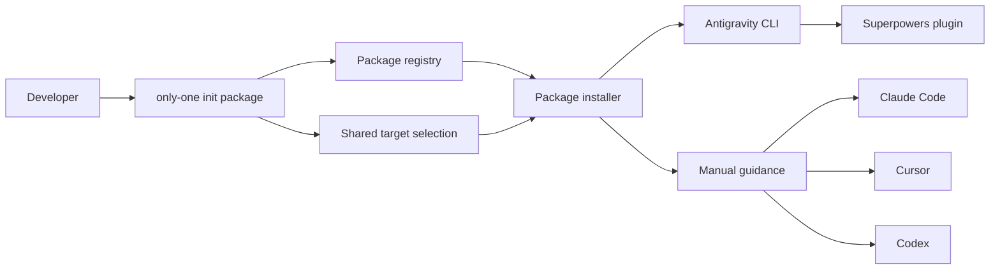

## Context

Current package manifests contain only npm package name, description, and local/global scope. Package detection and installation therefore always use `npm list` and `npm install`. Superpowers is not distributed as one npm package: each supported agent uses its own plugin mechanism.

The project already has shared explicit, automatic, and interactive target selection for Antigravity, Claude, Cursor, and Codex. This change reuses that selection and adds one small package-installer strategy rather than copying Superpowers skills or creating a new framework lifecycle.

Current ADR 0001 keeps project-specific setup orchestration in `only-one` while OpenSpec handles standard initialization. Target-aware package installation remains part of existing package setup and does not change that boundary.

### Lightweight C4 view

- Package registry identifies npm versus target-plugin installation.
- Existing target selector supplies supported agent IDs.
- Antigravity action is executable from shell.
- Claude, Cursor, and Codex actions are reported as official host instructions.
- Superpowers remains owned and updated by each host plugin system.

## Goals / Non-Goals

**Goals:**

- Expose Superpowers in existing package selection.
- Reuse current supported-agent selection.
- Execute official installation automatically where a shell CLI exists.
- Provide exact actionable guidance where installation requires host slash commands or UI.
- Prevent accidental installation of unrelated npm package `superpowers`.
- Keep results explicit per selected target.

**Non-Goals:**

- Bundling, adapting, or modifying Superpowers skills.
- Adding `only-one superpowers` lifecycle commands.
- Detecting plugin versions or managing updates across hosts.
- Adding lock files, hashes, ownership tracking, or three-way merge.
- Automating host slash commands or UI interactions.
- Adding targets outside current allowed target list.

## Decisions

### 1. Extend package manifest with installer strategy

Give package entries a stable ID independent from npm package name. Model installer as a discriminated union:

- `npm`: package name plus existing local/global scope.
- `target-plugin`: supported target IDs and one action per target.

Target action types:

- `command`: executable plus argument array.
- `manual`: exact instruction text and optional documentation URL.

Superpowers uses stable ID `superpowers`; it has no npm package name. Existing packages retain npm behavior.

Alternative: add `superpowers` as current `name`. Rejected because current installer would run `npm install superpowers`, which installs an unrelated package.

Alternative: hardcode a Superpowers branch in init. Rejected because typed manifest strategy is nearly as small and keeps selection, reporting, and future target-aware packages coherent.

### 2. Select targets only when required

When selected packages are npm-only, package flow remains unchanged and does not ask for targets. When any selected package uses `target-plugin`, resolve targets through shared target-selection behavior.

The package subcommand accepts the same target option convention used by other target-aware commands. Interactive flow prompts once and shares selected targets across target-aware packages.

Alternative: always prompt for targets in package flow. Rejected because npm packages do not depend on agents and existing behavior should remain stable.

### 3. Execute commands; report manual actions

For Superpowers:

- Antigravity command action executes `agy plugin install https://github.com/obra/superpowers` in project context.
- Claude manual action reports `/plugin install superpowers@claude-plugins-official`.
- Cursor manual action reports `/add-plugin superpowers`.
- Codex manual action reports `/plugins`, search `superpowers`, then choose `Install Plugin`.

Manual guidance counts as `action-required`, not `installed`. Overall output distinguishes installed, action-required, skipped, and failed per target. `--yes` skips selection confirmations but cannot convert manual host actions into automatic installation.

Alternative: launch agent CLIs and inject slash commands. Rejected because host command interfaces are interactive, unstable for automation, and may mutate user sessions unexpectedly.

### 4. Keep package execution centralized

Use one package installation service for package checks/actions and call it from existing init package paths. Avoid adding another package-name post-install branch. Existing npm-specific post-install behavior can remain initially, but Superpowers target action handling belongs in shared package strategy code.

Combo behavior is unchanged because this proposal does not add Superpowers to a combo.

## Risks / Trade-offs

- [Three targets are not fully automatic] -> Report exact official commands and mark them `action-required`, never falsely report installation success.
- [Host installation docs change] -> Keep target actions in one registry entry and cover exact rendered guidance with tests.
- [Bare npm package name collision] -> Separate stable package ID from npm package name and test that npm is never called for Superpowers.
- [Antigravity CLI is missing] -> Report command failure with executable name and retain guidance so user can install `agy` or run setup later.
- [Plugin installation status cannot be detected consistently] -> Do not claim detection or idempotence in this change; delegate lifecycle to host plugin managers.
- [Existing package specs describe stale YAML registries] -> Update only touched package requirements to current typed-registry behavior while preserving unrelated contracts.

## Migration Plan

1. Extend package types with stable IDs and installer strategy while mapping current package entries to npm installers.
2. Add Superpowers target-plugin registry entry.
3. Reuse shared target selection when target-aware packages are selected.
4. Implement command/manual target action execution and result reporting.
5. Add focused tests for existing npm behavior, Superpowers target actions, npm collision prevention, and manual guidance.
6. Update package command documentation and validate OpenSpec change.

Rollback removes the Superpowers registry entry and target-plugin strategy call path. Existing npm package installation remains compatible.

## Open Questions

None. Selected policy is automatic command execution when available and official manual guidance otherwise.
