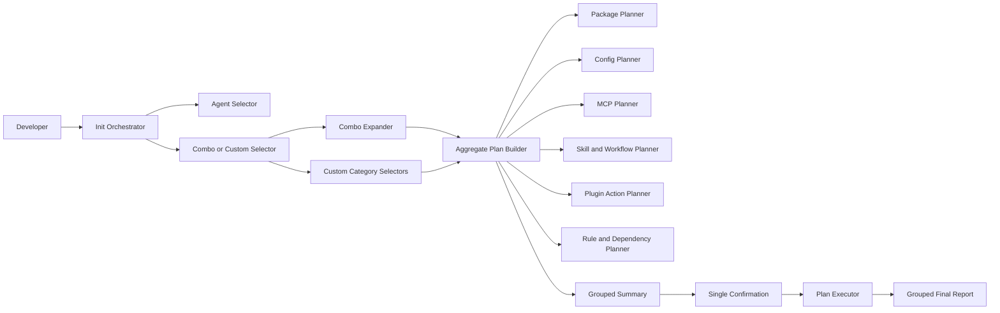

## Context

`only-one init` is currently an 850-line workflow that owns package/config/skill/MCP selection, combo expansion, existence checks, overwrite prompts, package-specific hooks, workflow inference, `.gitignore`, execution, and reporting. Standalone commands duplicate much of the same orchestration. Some checks run multiple times, some prompts occur after earlier categories have already mutated the system, and missing OpenSpec may be installed before the final summary.

Reusable seams already exist for target selection, skill/rule/MCP existence checks, rule dependency discovery, plugin execution, MCP transactional writes, and component installers. Missing pieces are a common immutable plan, prompt-free planners/executors per category, package/config planners, shared post-install actions, and grouped summary/report contracts.

Required init flow:

1. Select agents once.
2. Choose one combo or custom.
3. Combo expands through shared planners; custom visits Package → Config → MCP → Skill → Plugin → Rule, allowing empty selection each time.
4. Expand auto-required dependencies.
5. Build read-only new/existing/action plan.
6. Show one grouped summary.
7. Confirm once.
8. Execute frozen plan and continue after independent failures.
9. Show one grouped result report.

ADR 0001 states that init delegates standard tool setup to OpenSpec, but current code directly owns broader target and component orchestration. This design preserves OpenSpec-owned initialization where invoked, but flags factual ADR drift for a later superseding ADR if architecture documentation must match current product behavior.

### Lightweight C4 view



- Init owns sequence and aggregate state only.
- Category planners are read-only and reusable by standalone commands.
- Combo is selection expansion, not a second installer.
- Plan contains exact target-asset pairs and frozen overwrite decisions.
- No executor runs before confirmation.

## Goals / Non-Goals

**Goals:**

- Make init a pure orchestrator over reusable category services.
- Select agents once and preserve exact target scope.
- Support one combo or optional custom category selections.
- Build complete, read-only state before confirmation.
- Distinguish selected versus auto-required items and new versus existing state.
- Execute exact planned target-asset pairs without widening or late prompts.
- Continue independent work after failure and report all outcomes.
- Share plan/execution services with standalone commands.

**Non-Goals:**

- Cross-category rollback after partial execution.
- Plugin existence detection.
- Multiple combo selection in init.
- Removing standalone commands or explicit init surfaces.
- Changing supported target capabilities or asset formats.
- Changing external OpenSpec prompt behavior.

## Decisions

### 1. Introduce immutable aggregate plan contracts

Create shared plan types:

```ts
type InitCategory = 'package' | 'config' | 'mcp' | 'skill' | 'workflow' | 'plugin' | 'rule' | 'gitignore';
type PlanOrigin = 'selected' | 'auto-required';
type PlanState = 'new' | 'existing' | 'planned-action' | 'not-applicable';
type PlanDecision = 'install' | 'overwrite' | 'skip' | 'manual-action';

interface PlannedItem {
    key: string;
    category: InitCategory;
    assetId: string;
    targetId?: string;
    destination?: string;
    origin: PlanOrigin;
    state: PlanState;
    decision: PlanDecision;
    details?: string[];
}

interface InitPlan {
    projectDir: string;
    targetIds: string[];
    mode: 'combo' | 'custom';
    comboId?: string;
    items: PlannedItem[];
}
```

Keys use category, target, asset, and destination so state is precise per agent and path. Plugin items use `planned-action` and describe command/manual action, without new/existing claim.

Plan is frozen after summary. Executors consume decisions directly and do not prompt, select, widen target pairs, or rediscover dependencies.

Alternative: retain category-specific arrays. Rejected because aggregate summary and exact provenance need common fields.

### 2. Give each category prompt-free planner and executor

Each category exposes:

```ts
buildPlan(input): Promise<PlannedItem[]>
executePlan(items): Promise<ExecutionResult[]>
```

Optional command-layer selectors and formatters remain separate. Standalone commands and init share these functions. Existing read-only checks become planner inputs; existing mutating functions are adapted to explicit planned items.

Package service owns npm checks, installation, OpenSpec/UI-UX post-actions. Config service gains existence checks and copy executor. Skill service emits workflow dependencies rather than installing them internally. Rule service emits package/plugin/MCP/skill dependencies rather than executing them internally. Combo service becomes one-manifest expansion into ordinary selection IDs.

Alternative: invoke Commander commands from init. Rejected because command handlers own prompts/output and cannot produce a side-effect-free aggregate plan.

### 3. Select agents once and filter categories by capability

Init resolves one target set at start. Package/config are target-independent. MCP, skill, plugin, and rule planners receive subsets allowed by capability. Unsupported pairs are omitted from prompts and represented as not applicable only when useful in summary; they are not failures.

Custom prompt order is fixed:

1. Packages
2. Configs
3. MCPs
4. Skills
5. Plugins per agent
6. Rules per agent

Every category accepts empty selection. Plugin/rule prompts are per agent. No category re-prompts agents.

### 4. Combo mode chooses exactly one combo and uses same plan path

Combo selection is single-select. Combo expander resolves package/config/skill IDs and declared dependencies, then sends them through category planners. It does not call `installCombo()` as an independent execution workflow. Direct combo choices have selected origin; transitive dependencies have auto-required origin.

Standalone combo may later use the same plan composition, but init must not delegate to Commander or retain duplicate combo semantics.

Alternative: multiple combo merge. Rejected by user to keep choice and summary clear.

### 5. Expand dependencies before checking state

Aggregate dependency expansion runs to fixed point before final existence checks:

- Skill → associated workflow → required skill/MCP.
- Rule → required package/plugin/MCP/skill.
- Combo → declared components.
- Package post-actions and `.gitignore` entries become planned effects.

Deduplicate by item key. If directly selected and auto-required, origin becomes selected, with details retaining dependency reason. Summary groups auto-required separately for transparency.

No dependency prompt occurs. Final confirmation authorizes selected and auto-required items together.

### 6. Summary is category-grouped and state-aware

Pre-execution summary order matches custom and execution dependencies. Each category displays:

- Selected — New
- Selected — Existing, will overwrite/reinstall
- Auto-required — New
- Auto-required — Existing, will overwrite/reinstall
- Planned actions/manual actions for plugins

Package existence is local/global. Config state is per destination file. Skill/rule state is per agent destination. MCP state is per agent config. Plugin section lists agent/plugin and command/manual action without state.

Final confirmation means overwrite/reinstall every existing selected or auto-required item shown. Decline causes zero side effects.

### 7. Keep planning side-effect-free and execution prompt-free

No npm install, directory creation, file copy, MCP write, plugin command, `.gitignore` update, or post-install hook may occur before confirmation. Planning may read filesystem, package manager state, and global agent configs.

After confirmation, execute in dependency-aware order:

1. Packages and package post-actions
2. Configs
3. MCPs
4. Skills
5. Workflows and generated commands
6. Plugins
7. Rules
8. `.gitignore`
9. Readiness inspection

User requested custom selection order differs from execution order only where dependencies require it; summary retains user-facing category order and clearly shows auto-required items.

Each executor catches item/category failures, records them, and continues independent items. Dependent items may fail or skip with dependency reason, while unrelated categories continue.

### 8. Explicit init surfaces still require interactive confirmation

Main `init` retains `--step`, `--skip`, combo IDs, and component IDs for preselection/plan construction. Nested init component surfaces remain for compatibility. Regardless of explicit selections, init requires confirmation after summary. If confirm prompt is unavailable, it prints plan or actionable guidance and exits before execution. Automation uses standalone component commands.

Alternative: treat explicit plan as consent. Rejected because user requires init confirmation after summary.

### 9. Reuse one status/result model

Execution result keys match planned item keys. Aggregate report groups results by category and reports installed, overwritten/reinstalled, manual action required, skipped due dependency, and failed. It must not use “installed” to mean merely selected.

JSON output uses same plan/result model, avoiding a separate coarse response shape.

## Risks / Trade-offs

- [Large cross-cutting refactor] -> Introduce plan contracts and category adapters incrementally with characterization tests before replacing monolith.
- [State changes between plan and execution] -> Executors honor frozen decisions but validate destination preconditions where practical and report drift rather than silently changing policy.
- [No cross-category transaction] -> Confirm once, execute deterministic order, keep MCP transaction, continue and report partial outcomes; do not promise rollback.
- [Dependency cycles or duplicate expansion] -> Use typed domain graph, visited keys, fixed-point expansion, and cycle validation.
- [Plugin state unavailable] -> Show planned action only; never label new/existing.
- [Combo behavior diverges from standalone command] -> Move combo expansion into shared service and route both flows through it over time.
- [Existing installers recheck and widen selections] -> Refactor executors to accept exact planned items and remove internal selection/dependency logic.
- [ADR and canonical specs are stale] -> Treat current code and latest archived contracts as factual input; flag ADR supersession need rather than silently relying on obsolete delegation claims.
- [Headless init loses automation] -> Preserve standalone command automation and make init print clear interactive-confirm requirement.

## Migration Plan

1. Add plan/result contracts, summary renderer, execution coordinator, and characterization tests around current init.
2. Extract package and config planners/executors, including package post-actions.
3. Adapt MCP, skill/workflow, plugin, and rule services to exact planned items and dependency emission.
4. Replace combo installer path with single-combo expansion through aggregate planners.
5. Implement agent-first custom selectors and side-effect-free aggregate planning.
6. Add grouped summary and single confirmation; prove decline leaves zero side effects.
7. Replace monolithic execution with frozen-plan coordinator and grouped final report.
8. Route standalone and nested commands toward shared category services while retaining public CLI surfaces.
9. Remove dead init-specific branches, duplicate checks, late prompts, and coarse result types.
10. Update docs/specs and run focused/full verification.

Rollback restores monolithic init; no persistent data migration is required. Partially installed assets from failed executions remain visible in final reports and existing-resource checks on next run.

## Open Questions

- ADR 0001 no longer accurately describes current init ownership. A future ADR should supersede it after this architecture is accepted.
- Exact plan drift preconditions should be category-specific: file hash/mtime for local files, observed config snapshot for MCP, and best-effort status for npm.
- Standalone combo convergence onto the same aggregate planner is architecturally preferred; implementation may stage it after init parity is proven.
