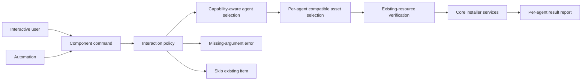

## Context

Target-aware standalone commands currently mix two interaction models. Skill, MCP, and combo select agents first, while plugin and rule select assets first. All seven mutable command families expose `--yes`, but the flag means different things: select all agents, select all assets, select the first combo, overwrite all existing resources, install OpenSpec, install workflows, or bypass final confirmation. Main init still prompts in several paths even with `--yes`, while missing prompt dependencies silently trigger select-all behavior elsewhere. Doctor advertises `--yes` despite not registering the option.

The required UX is agent-first. Interactive plugin/rule flows select agents, then show one compatible asset prompt per selected agent, with all compatible assets checked by default. CLI-wide `--yes` is removed. Automation remains possible through complete explicit component IDs and target IDs. Missing explicit inputs in non-TTY mode fail instead of guessing; existing resources are skipped when verification cannot run.

ADR 0001 remains accepted and not superseded. This change standardizes only-one-owned selection and confirmation behavior without replacing OpenSpec-owned prompts.

### Lightweight C4 view



- Interactive path prompts agents first, then compatible assets separately per agent.
- Explicit path bypasses only prompts answered by provided arguments.
- Missing prompt capability never implies select-all.
- Existing resources require interactive verification; headless execution skips them.
- Installers receive an explicit target-to-assets plan rather than global asset and target lists.

## Goals / Non-Goals

**Goals:**

- Standardize plugin and rule commands with agent-first interaction.
- Present compatible plugin/rule choices per selected agent, selected by default.
- Remove `--yes` from the complete CLI and delete dead/stale related behavior.
- Preserve safe non-interactive automation with complete explicit IDs.
- Fail clearly when required selections are absent in non-TTY mode.
- Never overwrite or reinstall existing resources without user verification.
- Keep deterministic per-agent results for partial and manual actions.

**Non-Goals:**

- Changing supported agent sets or target capabilities.
- Changing plugin action or rule dependency semantics.
- Adding a replacement global auto-confirm flag.
- Adding force-overwrite automation.
- Reworking OpenSpec-owned selection prompts.
- Changing asset registries or installation destinations.

## Decisions

### 1. Replace global asset selection with a target-to-assets plan

Plugin and rule commands first resolve agents. For each selected agent, derive compatible assets from manifest `supportedTargets` and prompt separately:

```text
Select agents: Claude, Cursor
Select plugins for Claude: [x] superpowers
Select plugins for Cursor: [x] superpowers
```

Each prompt defaults all compatible assets to checked. Result is a map from target ID to selected asset IDs. Explicit asset IDs plus explicit targets generate the same map after compatibility validation and skip prompts.

Alternative: one global asset prompt. Rejected because user requested per-agent support lists and future assets may support different target subsets.

Alternative: one flattened `agent › asset` prompt. Rejected because separate prompts make target context and defaults clearer.

### 2. Remove `--yes` and separate interaction policies

Delete Commander `--yes` options, option types, propagation, tests, examples, and dormant doctor fields. Do not replace them with another global flag. Selection policy becomes explicit:

- Explicit IDs supplied: validate and use them.
- Required IDs omitted and checkbox prompt exists: prompt.
- Required IDs omitted and no checkbox prompt exists: throw actionable error naming missing flags/arguments.
- Existing item and verification prompt exists: ask user which items to overwrite/reinstall, checked by default.
- Existing item and no verification prompt exists: skip and report it.

This removes automatic mode from command-facing selection. Core target selection may retain a low-level automatic option only if another internal caller needs it, but no missing-prompt fallback may enable it.

Alternative: replace with `--force` or `--non-interactive`. Rejected because user requires verification for existing resources and explicit IDs already describe automation intent.

### 3. Make explicit arguments sufficient consent for new work

Non-TTY component commands run when all required component IDs and target IDs are explicit. New resources are installed; existing resources are skipped. No final confirmation is needed because explicit command arguments define the plan.

Main init follows the same principle: a complete explicit plan executes new work and skips existing work. Interactive init still shows its pre-execution summary and requires confirmation. If main init lacks any selection needed by enabled steps and prompts are unavailable, it fails before side effects.

Alternative: forbid headless main init. Rejected because explicit plans provide deterministic automation without auto-confirm.

### 4. Keep `all` explicit but remove implicit all

Shared target selection continues accepting explicit CSV IDs and `all`. `--tool all` or `--ide all` is intentional and auditable. No command selects all merely because prompts are absent.

Plugin/rule explicit asset support follows current positional CSV IDs. If targets are explicit but asset IDs are absent in non-TTY mode, command reports missing asset IDs. If assets are explicit but targets absent, command reports missing target option.

### 5. Apply verification semantics consistently

Existing package reinstall, skill/rule overwrite, MCP reconfiguration, and combo component overwrite use checked interactive verification lists. In headless mode, overwrite lists remain empty, so existing items return skipped. Plugin command has no consistent host-level existence detection and retains its current action semantics; manual actions remain action-required.

Associated workflows after skill installation remain interactive. In non-TTY mode, missing associated workflows are reported as action-required or skipped, not silently auto-installed. Doctor becomes diagnosis-only in headless mode and prints remediation commands/scripts without claiming `doctor --yes` support.

### 6. Migration is intentionally breaking

Every `--yes` invocation fails Commander parsing after migration. Documentation provides replacements:

- Select all explicit targets with `--tool all` or `--ide all`.
- Pass component IDs positionally.
- Run interactively to verify overwrites/reinstalls.
- Accept headless skip behavior for existing resources.

Tests must assert removed options, missing-argument errors, prompt order, per-agent prompt content, checked defaults, and skip semantics.

## Risks / Trade-offs

- [Existing CI scripts break] -> Document direct replacements and emit standard unknown-option errors; provide explicit examples for every affected command.
- [More prompts for multiple agents] -> One prompt per agent gives accurate compatibility and defaults; explicit IDs remain concise for repeated automation.
- [Headless update cannot overwrite existing resources] -> Skip safely and require an interactive verification run for mutation.
- [Main init explicit-plan validation is complex] -> Build and validate complete selection plan before side effects using existing step/skip metadata.
- [Associated workflows no longer auto-install in automation] -> Report missing workflows clearly and allow explicit skill/workflow management in a separate interactive run.
- [Low-level callers relied on missing prompts selecting all] -> Add tests that missing prompts fail unless selections are explicit; audit every target-selection caller.
- [Plugin actions may run repeatedly because no existence check exists] -> Keep current plugin behavior; this change does not claim idempotent host plugin detection.

## Migration Plan

1. Add target-to-assets plan helper and plugin/rule prompt-order tests.
2. Refactor plugin/rule commands to agent-first, per-agent compatible asset prompts.
3. Remove `--yes` options and types from all registered commands and init internals.
4. Replace missing-prompt select-all branches with explicit missing-argument errors.
5. Change existing-resource headless behavior to skip, including package, skill, MCP, combo, and rule flows.
6. Reconcile associated workflow, OpenSpec bootstrap, final init confirmation, and doctor remediation behavior.
7. Rewrite tests and OpenSpec contracts formerly requiring `--yes`.
8. Update root help and README with explicit automation examples and breaking-change notice.
9. Run focused and full verification, then strict OpenSpec validation.

Rollback restores flags and previous implicit behavior, but no project data migration is involved.

## Open Questions

- Exact error wording should share one helper across commands and name accepted argument/option forms.
- Plugin action execution has no existing-resource verification because host plugin status is not consistently detectable; retained as current behavior.
- ADR 0001 remains in force; no supersession required.
